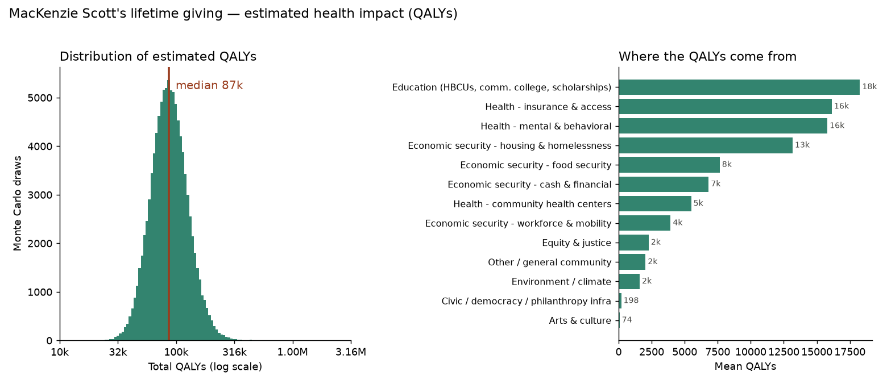
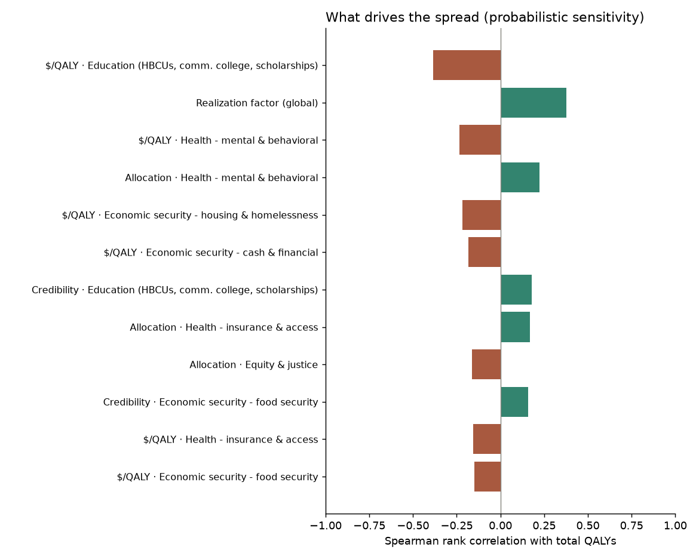

# MacKenzie Scott giving — QALY cost-effectiveness model

[](https://github.com/MaxGhenis/mackenzie-scott-qaly/actions/workflows/ci.yml)

**▶ Interactive version: [maxghenis.com/mackenzie-scott-qaly](https://maxghenis.com/mackenzie-scott-qaly)** — drag the assumptions and watch the model rerun in your browser (a TypeScript port of this package, reading the same `parameters.yaml`).

A GiveWell-style, fully-parameterized Monte Carlo estimate of the health impact
— in quality-adjusted life-years (QALYs) — of MacKenzie Scott's ~**$26.3 billion**
in lifetime philanthropy ($26.39B nominal 2020–2025, ~$30.3B in 2026 dollars as
modeled; Yield Giving reports over $26 billion in 2,700+ gifts).

It replaces hand-waved "$/QALY by sector" guesses with cost-effectiveness ratios
that are, wherever possible, **derived from published causal estimates** (Medicaid
mortality, community health centers, supportive housing, collaborative-care
depression, education→mortality). Each effect is then **shrunk toward the null in
proportion to how credibly it is causally identified** — a lottery RCT is trusted,
an associational correlation is not — and separately discounted for the gap
between a clean study and a marginal philanthropic dollar.

> **What QALYs do and don't capture.** A QALY is a *health* metric. Most of
> Scott's giving targets economic mobility, education, and equity, whose value is
> largely **non-health** (income, opportunity, rights, wellbeing). This model
> therefore *understates* her total social impact — it answers one specific
> question: how much *health* does the money buy? See "Interpretation" below.

## Quick start

```bash
uv sync --extra dev      # Python 3.14 venv + numpy/pyyaml/matplotlib
uv run msqaly            # 100k Monte Carlo draws — prints summary (no file writes)
uv run msqaly --write    # also regenerate results/ + figures + README block
uv run pytest            # test suite
```

`--write` is what regenerates the committed [`results/`](results/) artifacts
(`summary.md`, `summary.json`, `figure.png`, `sensitivity.png`) and the README
block below; a bare `uv run msqaly` only prints, so casual runs never dirty git.

## Method

The model is a transparent pipeline over `n` Monte Carlo draws (vectorized numpy,
seeded → reproducible). All inputs live in
[`data/parameters.yaml`](data/parameters.yaml); every value carries a `source`,
a typed `unit`, and — for dollar figures — a `dollars_base_year` that
[`validate.py`](src/msqaly/validate.py) checks against the base year on every
load, so a per-DALY figure in a per-QALY slot or an un-inflated old-dollar
figure fails loudly instead of shipping.

1. **Giving, at one price level.** Gifts are recorded as the exact disclosed
   nominal tranches ($26.39B across 2020–2025, each row linked to its
   disclosure) and each tranche is CPI-inflated to the 2026 base year
   (→ ~$30.3B), so the dollars and the cost-per-QALY inputs share one price
   level. Dividing nominal gifts by 2026-dollar costs would understate QALYs
   by ~13%.

2. **QALYs per death averted.** A discounted (3%/yr), quality-weighted annuity
   over remaining life expectancy with a half-cycle correction, calibrated to
   the low-income, middle-aged/older adults who dominate the causal mortality
   studies (~26 remaining years per Chetty et al. 2016's income–life-expectancy
   gradient; utility ~0.78 per US EQ-5D norms) → ~11–14 QALYs per premature
   death averted.

3. **Dollar allocation.** Scott does not publish dollars-by-cause, so the split
   across 13 intervention archetypes is drawn from a **Dirichlet** centered on
   the qualitative recipient picture (largest areas: equity & justice,
   education, economic security, health), with an author-set concentration
   controlling how tightly shares hold to those centers.

4. **Cost-per-QALY per archetype.** Three derivation methods:
   - `cost_per_life` — a published cost-per-life-saved ÷ QALYs-per-death. Used
     for **health insurance/access**: Sommers (2017, *AJHE*) $327k–$867k per
     life saved in 2007 dollars, CPI-inflated to $529k–$1.40M.
   - `cost_per_life_year` — a published cost-per-life-year ÷ the utility-weight
     draw (life-years → QALYs, explicitly). Used for **community health
     centers**: Bailey & Goodman-Bacon (2015) ~$54k/life-year in 2012 dollars,
     CPI-inflated to ~$79k.
   - `cost_per_qaly` — drawn from the cost-effectiveness literature with every
     anchor inflated to 2026 dollars (collaborative-care depression, supportive
     housing), or, for indirect buckets, a deliberately wide prior: *anchored
     to* a causal study where one exists (education→mortality; climate
     mortality-cost-of-carbon) and an explicit *skeptical author prior* where
     none does (equity & justice, civic, arts). Each `cost_per_qaly` is the
     cost-effectiveness **conditional on the effect being real and delivered**
     — causal doubt lives in the credibility axis, delivery doubt in
     realization, so no layer double-counts.

5. **Causal credibility (the evidence-quality axis).** Each archetype is rated
   by the identification design of its evidence — `randomized` (RCT/lottery),
   `strong_quasi`, `moderate_quasi`, `observational`, `projection`, or
   `assumption` — and a credibility weight is drawn from that tier's Beta
   distribution (means 0.85 → 0.07; weaker designs are also wider). It linearly
   shrinks QALYs/dollar toward the null of *no health effect*. Credibility is
   **internal validity only**; transport to Scott's grantees belongs to
   realization. The tier levels are author-elicited priors — the ordering is
   the defensible part — and the interactive's evidence-stance slider sweeps
   them from skeptical to face-value.

6. **Realization factor.** One global multiplier (triangular, mode 0.80, range
   0.55–1.10; author-elicited) for everything between a real effect and her
   marginal grant — external validity/transport, overhead, funging — net of
   the capacity benefits of large unrestricted gifts (CEP 2023).

7. **QALYs** = dollars × share × realization × credibility ÷ cost-per-QALY,
   summed across archetypes.

8. **Monetize & benchmark.** QALYs × HHS's published **value per QALY**
   (VQALY, Table 3 of the 2026 Data Point: $339k/$726k/$1,105k at 3% in
   constant 2025 dollars, CPI-inflated to $353k/$756k/$1,150k) gives the
   benefit/cost ratio — the correct series for QALY monetization, replacing
   the earlier VSLY-applied-to-QALYs convention. The global-health frontier is
   a QALY-equivalent cost derived from GiveWell's current program averages
   ($4,000–$5,500 per under-5 life saved, 2022–2024, inflated → ÷ ~25.1
   discounted QALYs per child death → loguniform $150–$260, central ~$197),
   denominated at the 3% reference rate and rescaled by the child-QALE ratio
   when the model runs at another rate, then *handicapped with the same
   realization and credibility* so the counterfactual benchmark is
   like-for-like at any discount setting.

## Results

See [`results/summary.md`](results/summary.md) (regenerated by `uv run msqaly
--write`). Headline figures are reproduced there rather than hard-coded here, so
the README never drifts from the model. As of the committed run:

<!-- RESULTS:START -->
**Median ≈ 87k QALYs** (mean 93k; 90% interval 48k–161k), a blended **$350k/QALY**. Monetized at HHS's value per QALY that is **$64.1B** of health value — a **2.1× benefit/cost ratio**. The same $30.3B at the global-health frontier (~$197/QALY-equivalent), handicapped with the same realization and evidence discounts, would still buy ~105.44M QALYs — about **1215× more health per dollar**, the price of funding a rich country's social fabric rather than the global frontier.



The spread is driven mostly by the global realization factor, the causal-credibility weights, and the cost-per-QALY of the largest buckets (education, equity & justice):



_Full table: [results/summary.md](results/summary.md). Regenerate with `uv run msqaly --write`._
<!-- RESULTS:END -->

## Interpretation

- **The estimate is dominated by the cost-per-QALY *and credibility* assumptions,
  not the dollar total.** Grounding the ratios in causal estimates and then
  weighting by identification quality (rather than a flat US cost-effectiveness
  threshold) is the whole point of this repo.
- **Causal skepticism roughly halves the headline.** Taking evidence quality
  seriously drops the central estimate from trusting every cited effect at face
  value to the lower evidence-weighted estimate. The buckets that survive are
  the ones with the strongest designs
  (collaborative-care RCTs, the Medicaid difference-in-differences); the largest
  *dollar* buckets (equity & justice, education) contribute little health because
  no credible study ties those grants to QALYs — their value is real but largely
  non-health.
- **US ≠ global-health frontier.** Preventing a death costs orders of magnitude
  more in a rich country than via bed nets abroad; the frontier comparison
  quantifies that gap, and is not a criticism of her choices.
- **QALYs ≠ total value.** A WELLBY (wellbeing-year) or consumption-value frame
  would credit the economic-security and education giving far more. This model is
  deliberately scoped to health.

## Limitations

- Allocation shares are an informed prior, not Scott's actual ledger. Swapping in
  a dollar-coded recipient database (Yield Giving) would sharpen the split.
- Several archetypes (equity & justice, civic, arts) have no clean health pathway;
  their wide distributions reflect genuine ignorance, not measured effect.
- Causal estimates are transported across populations and time; the realization
  factor is a coarse correction.
- **Correlation structure is stylized.** Credibility is drawn independently per
  archetype while realization is one global draw — two opposite extremes. A
  tier-correlated credibility variant widens the 90% interval by ~7% and leaves
  the median unchanged. Credibility is also strictly positive: the model puts no
  probability on zero or harmful effects (assumption-tier means of 0.07
  approximate, but never reach, a null).
- **The evidence-tier levels, realization triangle, and Dirichlet concentration
  are author-elicited priors**, not literature estimates; they are labeled as
  such in the parameter file, and the sensitivity tornado + interactive sliders
  are the stress test.
- Monetization uses HHS's published value per QALY; it affects only the
  benefit/cost ratio, never the QALY count.
- Effects are modeled as static cost-per-QALY ratios, not a dynamic life-table
  microsimulation.

## Layout

```
data/parameters.yaml     all inputs, each with a citation
src/msqaly/
  distributions.py       spec -> Monte Carlo samples
  model.py               causal chains + propagation
  cli.py                 run, summarize, plot
tests/test_model.py      integrity, distribution, and end-to-end tests
SOURCES.md               annotated bibliography
results/                 generated outputs (committed)
```

## Sources

Full annotated bibliography in [`SOURCES.md`](SOURCES.md). Not affiliated with,
or endorsed by, MacKenzie Scott, Yield Giving, or GiveWell.
